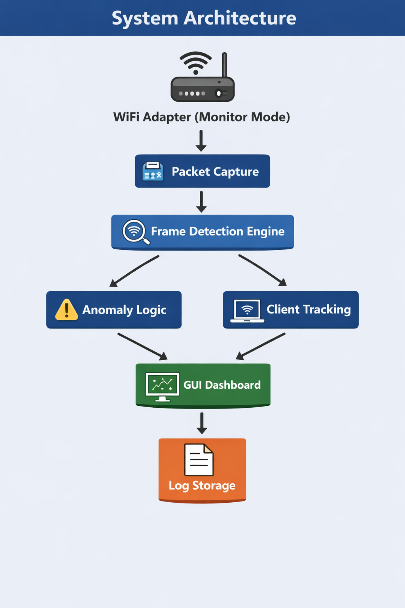
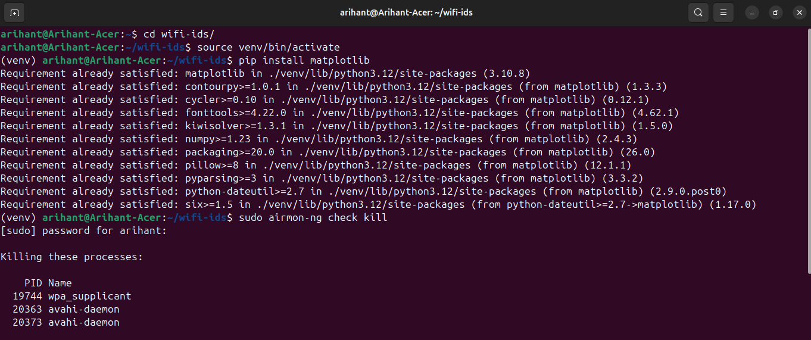
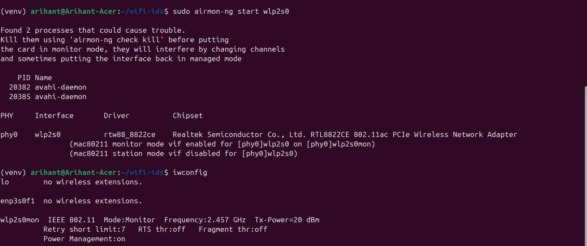
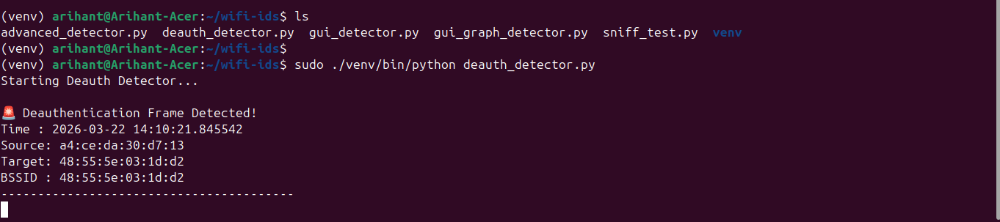
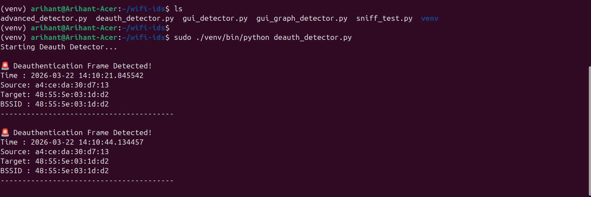
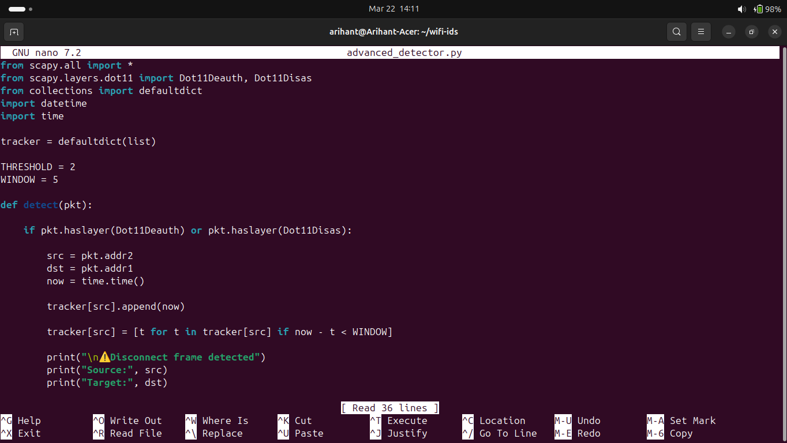
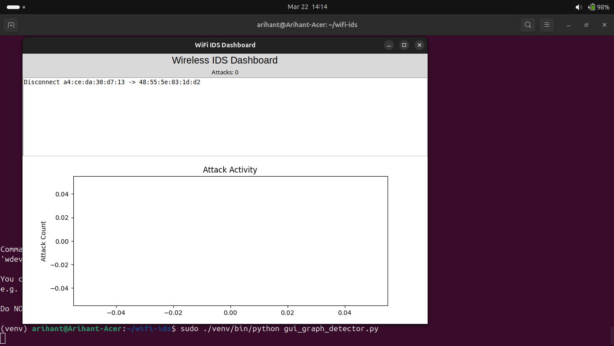

# Wireless Deauthentication Detection Dashboard
## Scapy + Linux Monitor Mode + Tkinter/Matplotlib

## Project Summary
This project implements a real-time **Wireless Intrusion Detection System (WIDS)** focused on identifying WiFi deauthentication and disassociation behavior.

The system captures raw 802.11 management frames in monitor mode, applies anomaly-based detection logic, tracks impacted clients, visualizes activity in a GUI dashboard, and stores logs for forensic review.

## Objectives
- Capture 802.11 frames in monitor mode.
- Detect deauthentication (`Dot11Deauth`) and disassociation (`Dot11Disas`) frames.
- Identify abnormal disconnect bursts using sliding-window threshold logic.
- Track attacker and impacted client MAC addresses.
- Visualize events and alert counts in a live GUI dashboard.
- Log events in human-readable and JSONL formats.
- Provide practical WPA3/PMF-aware wireless security monitoring workflow.

## System Architecture
### Architecture Overview
1. Monitor-mode wireless interface captures management frames.
2. Detection engine parses deauth/disassoc packets.
3. Anomaly logic counts repeated events in a short time window.
4. Client-tracking logic correlates attacker activity to affected clients.
5. GUI displays live incidents and attack trends.
6. Logs are written for post-incident analysis.



## Technologies Used
- Python 3
- Scapy
- Matplotlib
- Tkinter (Python GUI)
- Aircrack-ng
- Ubuntu Linux
- 802.11 Monitor Mode

## Repository Structure
```text
.
|-- advanced_detector.py
|-- deauth_detector.py
|-- gui_logging_detector.py
|-- sniff_test.py
|-- requirements.txt
|-- architecture/
|   `-- wireless-deauthentication-detection-architecture.png
|-- docs/
|   |-- wireless-deauthentication-detection-dashboard.docx
|   |-- wireless-deauthentication-detection-dashboard.pdf
|   `-- images/
|-- logs/
`-- src/wifi_ids/
```

## Installation and Setup
### 1) Install Required Packages
```bash
sudo apt update
sudo apt install -y aircrack-ng python3-venv python3-full python3-tk
```

### 2) Create Virtual Environment
```bash
mkdir wifi-ids
cd wifi-ids
python3 -m venv venv
source venv/bin/activate
pip install -r requirements.txt
```

### 3) Enable Monitor Mode
```bash
sudo airmon-ng check kill
sudo airmon-ng start wlp2s0
```




### 4) (Optional) Lock Interface Channel
```bash
sudo ip link set wlp2s0mon down
sudo iw dev wlp2s0mon set channel 149
sudo ip link set wlp2s0mon up
```

## Running the Project
### GUI Dashboard + Logging (Recommended)
```bash
sudo ./venv/bin/python gui_logging_detector.py \
  --interface wlp2s0mon \
  --threshold 3 \
  --window 10
```

### Terminal Detector
```bash
sudo ./venv/bin/python deauth_detector.py \
  --interface wlp2s0mon \
  --threshold 3 \
  --window 10 \
  --print-events
```

### Advanced Detector with Periodic Summaries
```bash
sudo ./venv/bin/python advanced_detector.py \
  --interface wlp2s0mon \
  --threshold 3 \
  --window 10 \
  --summary-every 15
```

### Sniff Validation Test
```bash
sudo ./venv/bin/python sniff_test.py --interface wlp2s0mon --count 40 --timeout 30
```

## Dashboard and Output Snapshots
### Deauthentication Detection in Terminal



### Anomaly Logic (Code Snapshot)


### GUI Dashboard


## Example Event Log
```text
[2026-03-22 15:40:11] ALERT
Frame: deauthentication
Attacker: a4:ce:da:30:d7:13
Client: 48:55:5e:03:1d:d2
BSSID: 48:55:5e:03:1d:d2
WindowCount(attacker/10s): 3
WindowCount(pair/10s): 2
AffectedClients(10s): 1
Interface: wlp2s0mon
```

## How Detection Works
The detector flags any deauthentication/disassociation frame as an event. It then applies a sliding time window:
- Count events from each attacker MAC in the configured window.
- If the count reaches the configured threshold, classify as `ALERT`.
- Track per-attacker client coverage to estimate attack impact.
- Forward events to GUI and logs in real time.

## Command-Line Options (GUI)
```bash
python gui_logging_detector.py --help
```

Key options:
- `--interface`: monitor mode interface (default `wlp2s0mon`)
- `--threshold`: alert threshold in window (default `3`)
- `--window`: window size in seconds (default `10`)
- `--deauth-only`: ignore disassociation frames
- `--ignore-broadcast-client`: drop broadcast-target events
- `--channel` + `--lock-channel`: apply channel lock sequence
- `--log-file`: text log path
- `--json-log`: JSONL log path
- `--demo`: run dashboard with synthetic events

## Testing Method Used
The dashboard was validated with:
- Wireless clients (laptop and mobile phone) on live WiFi.
- Manual disconnect/reconnect and WiFi toggling to generate events.
- WPA3/WiFi 6 network conditions.
- Verification of real-time GUI updates and log persistence.

## Limitations
- WPA3 Protected Management Frames (PMF) can reduce visible deauth/disassoc frames.
- Silent disconnect behavior on some clients may bypass explicit management frames.
- Requires monitor-mode-capable wireless hardware and driver support.
- Channel mismatch can hide events from other channels.

## Future Enhancements
- Web dashboard (Flask/FastAPI + live charts).
- Prometheus metrics exporter for alert counters.
- Alert routing (email, webhook, Slack/Telegram).
- Multi-channel scanning and multi-adapter support.
- RSSI-based attacker localization estimation.

## Documentation
- Project report DOCX: `docs/wireless-deauthentication-detection-dashboard.docx`
- Project report PDF: `docs/wireless-deauthentication-detection-dashboard.pdf`

## Skills Demonstrated
- 802.11 packet capture and wireless management-frame analysis.
- Sliding-window anomaly detection.
- Real-time event-driven GUI design.
- Security event logging for forensic workflows.
- Linux wireless tooling (airmon-ng/iw/ip).

## Conclusion
This implementation delivers a practical wireless deauthentication detection workflow with real-time visibility and logging. It can be used for WiFi security monitoring, lab demonstrations, and further IDS research, while remaining simple to run and extend.
